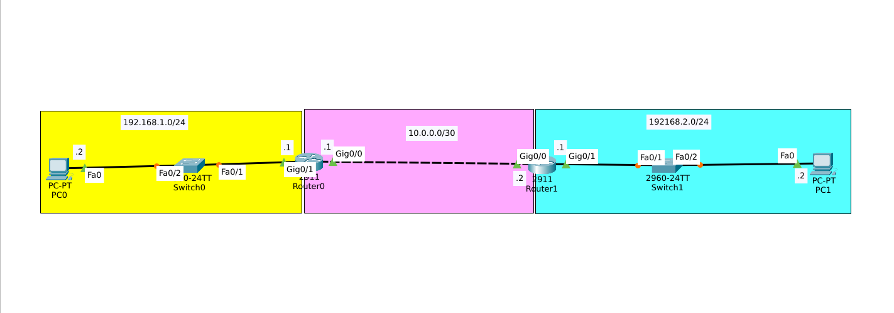
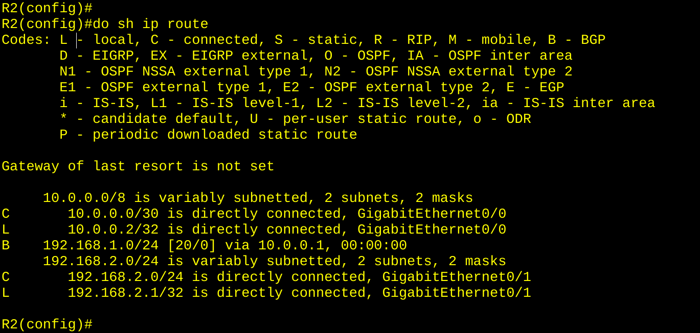

# BGP Basic Peering Lab



## 📌 Overview

A small two-router lab demonstrating **eBGP peering** between two autonomous systems.
Each router advertises its LAN network to its neighbor, and both learn the
remote network via BGP.

This lab proves that BGP, at its core, works like static routing —
you manually tell the router **who to peer with** and **what to advertise**.

## 🎯 Objective

- Configure eBGP between two routers in different autonomous systems
- Advertise each LAN network via BGP
- Verify BGP neighbor adjacency and route propagation

## 📊 Topology


```
┌─────────────┐         ┌─────────────┐
│   LAN 1     │         │   LAN 2     │
│ 192.168.1.0 │         │ 192.168.2.0 │
│    /24      │         │    /24      │
└──────┬──────┘         └──────┬──────┘
       │                       │
   ┌───┴───┐               ┌───┴───┐
   │  R1   │───10.0.0.0/30──│  R2   │
   │ AS 1  │               │ AS 2  │
   └───────┘               └───────┘
```

### Devices Used

- **2×** Cisco 2911 routers (R1, R2)
- **2×** Cisco 2960 switches
- **2×** PC-PT

## 📋 IP Addressing Table

| Device | Interface | IP Address | Subnet Mask |
|--------|-----------|------------|-------------|
| R1 | Gig0/0 | 10.0.0.1 | 255.255.255.252 |
| R1 | Gig0/1 | 192.168.1.1 | 255.255.255.0 |
| R2 | Gig0/0 | 10.0.0.2 | 255.255.255.252 |
| R2 | Gig0/1 | 192.168.2.1 | 255.255.255.0 |
| PC0 | NIC | 192.168.1.2 | 255.255.255.0 |
| PC1 | NIC | 192.168.2.2 | 255.255.255.0 |

## ⚙️ BGP Configuration

### R1 (AS 1)

```
router bgp 1
 no synchronization
 bgp log-neighbor-changes
 neighbor 10.0.0.2 remote-as 2
 network 192.168.1.0 mask 255.255.255.0
```

### R2 (AS 2)

```
router bgp 2
 no synchronization
 bgp log-neighbor-changes
 neighbor 10.0.0.1 remote-as 1
 network 192.168.2.0 mask 255.255.255.0
```

### ⚠️ Key Notes

- **eBGP** is used because the routers are in **different AS numbers**.
- `neighbor X.X.X.X remote-as Y` defines the peer and its AS.
- `network X.X.X.X mask Y.Y.Y.Y` advertises the LAN into BGP.
- BGP uses **TCP port 179** for peering.
- The `[20/0]` in `show ip route` means:
  - **20** = administrative distance (eBGP)
  - **0** = BGP metric (not used for eBGP)

## 🔍 Verification

### BGP Neighbor Adjacency

On R1:
```
R1#show ip bgp summary
```

Expected:
```
BGP router identifier 10.0.0.1, local AS number 1
Neighbor    V    AS   MsgRcvd  MsgSent  TblVer  InQ OutQ Up/Down  State/PfxRcd
10.0.0.2    4     2        12       14       3    0    0 00:05:22        1
```

The `%BGP-5-ADJCHANGE: neighbor 10.0.0.2 Up` message confirms peering.

### BGP Route Table

On R1:
```
R1#show ip route
```

Expected:
```
C    10.0.0.0/30 is directly connected, GigabitEthernet0/0
L    10.0.0.1/32 is directly connected, GigabitEthernet0/0
C    192.168.1.0/24 is directly connected, GigabitEthernet0/1
L    192.168.1.1/32 is directly connected, GigabitEthernet0/1
B    192.168.2.0/24 [20/0] via 10.0.0.2, 00:00:00
```

The `B` route is learned via BGP. ✅

### BGP Advertised Routes

On R1:
```
R1#show ip bgp neighbors 10.0.0.2 advertised-routes
```

On R1:
```
R1#show ip bgp neighbors 10.0.0.2 routes
```

## 🧠 What I Learned

- **BGP is like static routing** — you manually tell the router who to peer with and what to advertise.
- **eBGP vs iBGP** — different AS numbers = eBGP.
- **TCP 179** — BGP uses TCP, not UDP.
- **Administrative distance** — eBGP has AD 20, lower than EIGRP (90) and OSPF (110).
- **Route verification** — `show ip route` shows `B` entries for BGP-learned routes.
- **Neighbor state** — `%BGP-5-ADJCHANGE: neighbor Up` confirms peering.

## 🎯 Key Insight

> BGP is often seen as a "CCNP/CCIE" topic, but at its core it works
> like static routing — you define who to talk to and what to advertise.
> The complexity comes from **attributes, policies, and path selection**,
> not the basic setup.

## 🛠️ Tools

- Cisco Packet Tracer 8.x
- 2× Cisco 2911 routers
- 2× Cisco 2960 switches

## 📸 Screenshots

| Topology |
|----------|
||
|  |
|  |
|  |
|  |

## 👤 Author

**Zero** — Linux & IT Infrastructure Specialist

- 🌐 [zero.ma](https://zero.ma) · [cybernetwork.technology](https://cybernetwork.technology)
- 🐙 [GitHub @0x9z](https://github.com/0x9z)
- 💼 [LinkedIn](https://linkedin.com/in/0x9z)

## 📄 License

MIT — free to use for learning.
