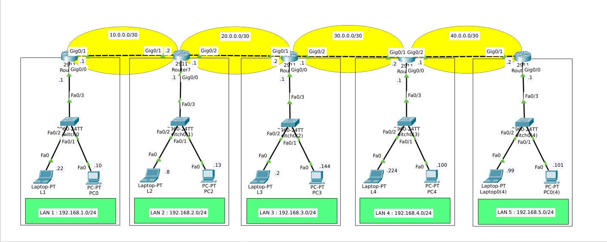

# BGP Multi-AS Chain



## 📌 Overview

A five-router eBGP chain across **five autonomous systems** (AS 100–500).
Each router advertises its LAN network, and BGP propagates every route
end-to-end across the chain.

This lab proves that BGP, at its core, works like static routing —
you manually tell each router **who to peer with** and **what to advertise** —
but the routes propagate across multiple ASes automatically.

## 🎯 Objective

- Configure eBGP between 5 routers in 5 different autonomous systems
- Advertise each LAN network into BGP
- Verify full end-to-end connectivity across the chain
- Confirm AS path propagation with `show ip route` and `tracert`

## 📊 Topology


```
LAN1            LAN2            LAN3            LAN4            LAN5
192.168.1.0/24  192.168.2.0/24  192.168.3.0/24  192.168.4.0/24  192.168.5.0/24
    │               │               │               │               │
  ┌─┴─┐  10.0.0.0/30 ┌─┴─┐  20.0.0.0/30 ┌─┴─┐  30.0.0.0/30 ┌─┴─┐  40.0.0.0/30 ┌─┴─┐
  │R1 │──────────────│R2 │──────────────│R3 │──────────────│R4 │──────────────│R5 │
  │AS │              │AS │              │AS │              │AS │              │AS │
  │100│              │200│              │300│              │400│              │500│
  └───┘              └───┘              └───┘              └───┘              └───┘
```

### Devices Used

- **5×** Cisco 2911 routers (R1, R2, R3, R4, R5)
- **5×** Cisco 2960 switches (one per LAN)
- **5×** Laptop-PT + PC-PT (two devices per LAN)

## 📋 IP Addressing Table

### LAN Networks

| LAN | Network | Gateway |
|-----|---------|---------|
| LAN 1 | 192.168.1.0/24 | 192.168.1.1 |
| LAN 2 | 192.168.2.0/24 | 192.168.2.1 |
| LAN 3 | 192.168.3.0/24 | 192.168.3.1 |
| LAN 4 | 192.168.4.0/24 | 192.168.4.1 |
| LAN 5 | 192.168.5.0/24 | 192.168.5.1 |

### WAN Links

| Link | Network | R-side A | R-side B |
|------|---------|----------|----------|
| R1 ↔ R2 | 10.0.0.0/30 | 10.0.0.1 | 10.0.0.2 |
| R2 ↔ R3 | 20.0.0.0/30 | 20.0.0.1 | 20.0.0.2 |
| R3 ↔ R4 | 30.0.0.0/30 | 30.0.0.1 | 30.0.0.2 |
| R4 ↔ R5 | 40.0.0.0/30 | 40.0.0.1 | 40.0.0.2 |

## ⚙️ BGP Configuration

### R1 (AS 100)

```
router bgp 100
 bgp log-neighbor-changes
 neighbor 10.0.0.2 remote-as 200
 network 192.168.1.0 mask 255.255.255.0
```

### R2 (AS 200)

```
router bgp 200
 bgp log-neighbor-changes
 neighbor 10.0.0.1 remote-as 100
 neighbor 20.0.0.2 remote-as 300
 network 192.168.2.0 mask 255.255.255.0
```

### R3 (AS 300)

```
router bgp 300
 bgp log-neighbor-changes
 neighbor 20.0.0.1 remote-as 200
 neighbor 30.0.0.2 remote-as 400
 network 192.168.3.0 mask 255.255.255.0
```

### R4 (AS 400)

```
router bgp 400
 bgp log-neighbor-changes
 neighbor 30.0.0.1 remote-as 300
 neighbor 40.0.0.2 remote-as 500
 network 192.168.4.0 mask 255.255.255.0
```

### R5 (AS 500)

```
router bgp 500
 bgp log-neighbor-changes
 neighbor 40.0.0.1 remote-as 400
 network 192.168.5.0 mask 255.255.255.0
```

### ⚠️ Key Notes

- **eBGP** is used because each router is in a **different AS**.
- `neighbor X.X.X.X remote-as Y` defines the peer and its AS.
- `network X.X.X.X mask Y.Y.Y.Y` advertises the LAN into BGP.
- BGP uses **TCP port 179** for peering.
- The `[20/0]` in `show ip route` means:
  - **20** = administrative distance (eBGP)
  - **0** = BGP metric (not used for eBGP)

## 🔍 Verification

### BGP Neighbor Adjacency

On R1:
```
R1#show ip bgp summary
```

Expected:
```
Neighbor    V    AS   MsgRcvd  MsgSent  TblVer  InQ OutQ Up/Down  State/PfxRcd
10.0.0.2    4   200        12       14       3    0    0 00:05:22        4
```

### BGP Route Table (R1)

```
R1#show ip route
```

Expected:
```
B    192.168.2.0/24 [20/0] via 10.0.0.2, 00:00:00
B    192.168.3.0/24 [20/0] via 10.0.0.2, 00:00:00
B    192.168.4.0/24 [20/0] via 10.0.0.2, 00:00:00
B    192.168.5.0/24 [20/0] via 10.0.0.2, 00:00:00
```

**All remote LANs are learned via BGP.** ✅

### End-to-End Connectivity (Laptop1 → PC4)

```
C:\>ping 192.168.5.101
Reply from 192.168.5.101: bytes=32 time<1ms TTL=123
Sent = 4, Received = 4, Lost = 0 (0% loss)
```

### Tracert Output

```
C:\>tracert 192.168.5.101
  1   192.168.1.1      (R1)
  2   10.0.0.2         (R2)
  3   20.0.0.2         (R3)
  4   30.0.0.2         (R4)
  5   40.0.0.2         (R5)
  6   192.168.5.101    (PC4)
Trace complete.
```

**5 routers traversed. Full path confirmed.** ✅

## 🧠 What I Learned

- **eBGP across multiple ASes** — each router peers with its neighbor in a different AS
- **AS path propagation** — routes carry the AS numbers they passed through
- **Administrative distance** — eBGP has AD 20, lower than EIGRP (90) and OSPF (110)
- **Route advertisement** — `network X.X.X.X mask Y.Y.Y.Y` advertises the LAN
- **TCP 179** — BGP uses TCP, not UDP
- **Multi-hop routing** — packets traverse 5 routers automatically
- **Verification** — `show ip bgp summary`, `show ip route`, `tracert`
- **Self-debugging** — caught mask typos, verified each step

## 🎯 Key Insight

> BGP is often seen as a "CCNP/CCIE" topic, but at its core it works
> like static routing — you define who to talk to and what to advertise.
> The complexity comes from **attributes, policies, and path selection**,
> not the basic setup.
>
> Packet Tracer only supports **eBGP** (different AS numbers).
> For **iBGP** (same AS), you need GNS3 or EVE-NG.

## 🛠️ Tools

- Cisco Packet Tracer 8.x
- 5× Cisco 2911 routers
- 5× Cisco 2960 switches

## 📸 Screenshots

| Topology | BGP Summary | Route Table | Ping Test |
|----------|-------------|-------------|-----------|
| `topology.png` | `show-ip-bgp-summary.png` | `show-ip-route.png` | `ping-test.png` |

## 👤 Author

**Zero** — Linux & IT Infrastructure Specialist

- 🌐 [zero.ma](https://zero.ma) · [cybernetwork.technology](https://cybernetwork.technology)
- 🐙 [GitHub @0x9z](https://github.com/0x9z)
- 💼 [LinkedIn](https://linkedin.com/in/0x9z)

## 📄 License

MIT — free to use for learning.
