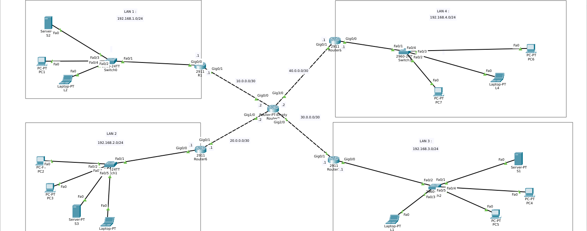

# DHCP Hub-and-Spoke Network with EIGRP



## Overview

A hub-and-spoke enterprise network built in Cisco Packet Tracer where **each
edge router acts as a DHCP server** for its LAN, and **EIGRP AS 1** provides
dynamic routing between all sites.

The topology spans **4 LANs** connected through **4 edge routers** and
**1 central hub router**, with automatic IP assignment for all client PCs.

## Objective

- Configure **DHCP pools** on each edge router (R1–R4)
- Configure **DHCP excluded-addresses** for static devices (servers, routers)
- Configure **EIGRP AS 1** with `no auto-summary` for dynamic routing
- Verify **DORA** (Discover, Offer, Request, Acknowledge) works
- Test end-to-end connectivity across the hub-and-spoke topology
- Confirm DHCP leases with `show ip dhcp binding`

## Topology


```
        LAN1                LAN2                LAN3                LAN4
    192.168.1.0/24      192.168.2.0/24      192.168.3.0/24      192.168.4.0/24
         │                   │                   │                   │
       ┌─┴─┐               ┌─┴─┐               ┌─┴─┐               ┌─┴─┐
       │R1 │               │R2 │               │R3 │               │R4 │
       │DHCP│              │DHCP│              │DHCP│              │DHCP│
       └─┬─┘               └─┬─┘               └─┬─┘               └─┬─┘
         │                   │                   │                   │
         │ 10.0.0.0/30       │ 20.0.0.0/30       │ 30.0.0.0/30       │ 40.0.0.0/30
         │                   │                   │                   │
         └─────────┬─────────┴─────────┬─────────┴─────────┬─────────┘
                   │                   │                   │
                 Gig0/0              Gig1/0              Gig2/0        Gig3/0
                   └─────────── PT-ROUTER-1 (Hub) ────────┘
                              EIGRP AS 1
```

### Devices Used

- **4×** Cisco 2911 edge routers (R1, R2, R3, R4) — DHCP servers
- **1×** PT-Router hub (PT-ROUTER-1) — 4 Gigabit interfaces
- **4×** Cisco 2960 switches
- **7×** PC-PT / Laptop-PT (DHCP clients)
- **3×** Server-PT (static IP)

## IP Addressing Table

### LAN Networks

| LAN | Network | Gateway | DHCP Pool |
|-----|---------|---------|-----------|
| LAN 1 | 192.168.1.0/24 | 192.168.1.1 | 192.168.1.81 – .254 |
| LAN 2 | 192.168.2.0/24 | 192.168.2.1 | 192.168.2.14 – .254 |
| LAN 3 | 192.168.3.0/24 | 192.168.3.1 | 192.168.3.100 – .254 |
| LAN 4 | 192.168.4.0/24 | 192.168.4.1 | 192.168.4.26 – .254 |

### WAN Links (Hub ↔ Spokes)

| Link | Network | Hub IP | Spoke IP |
|------|---------|--------|----------|
| R1 ↔ Hub | 10.0.0.0/30 | 10.0.0.2 | 10.0.0.1 |
| R2 ↔ Hub | 20.0.0.0/30 | 20.0.0.2 | 20.0.0.1 |
| R3 ↔ Hub | 30.0.0.0/30 | 30.0.0.2 | 30.0.0.1 |
| R4 ↔ Hub | 40.0.0.0/30 | 40.0.0.2 | 40.0.0.1 |

## DHCP Configuration

### R1 — LAN 1

```
ip dhcp pool lan1
 network 192.168.1.0 255.255.255.0
 default-router 192.168.1.1
 dns-server 8.8.8.8
 exit
ip dhcp excluded-address 192.168.1.1 192.168.1.80
```

### R2 — LAN 2

```
ip dhcp pool lan2
 network 192.168.2.0 255.255.255.0
 default-router 192.168.2.1
 dns-server 8.8.8.8
 exit
ip dhcp excluded-address 192.168.2.1 192.168.2.13
```

### R3 — LAN 3

```
ip dhcp pool lan3
 network 192.168.3.0 255.255.255.0
 default-router 192.168.3.1
 dns-server 8.8.8.8
 exit
ip dhcp excluded-address 192.168.3.1 192.168.3.99
```

### R4 — LAN 4

```
ip dhcp pool lan4
 network 192.168.4.0 255.255.255.0
 default-router 192.168.4.1
 dns-server 8.8.8.8
 exit
ip dhcp excluded-address 192.168.4.1 192.168.4.25
```

### Why Exclude Addresses?

Excluded addresses are reserved for **static devices**:
- Router interfaces
- Servers (SRV1, SRV2, SRV3)
- Printers
- Network equipment

DHCP only assigns from the **remaining pool**.

## EIGRP Configuration

Applied on **all 5 routers**:

```
router eigrp 1
 no auto-summary
 network <classful-network>
 exit
```

| Router | Network Statements |
|--------|--------------------|
| R1 | `192.168.1.0` · `10.0.0.0` |
| R2 | `192.168.2.0` · `20.0.0.0` |
| R3 | `192.168.3.0` · `30.0.0.0` |
| R4 | `192.168.4.0` · `40.0.0.0` |
| PT-ROUTER-1 | `10.0.0.0` · `20.0.0.0` · `30.0.0.0` · `40.0.0.0` |

### Key Notes

- **EIGRP AS number must match** on all routers (AS 1 used here).
- `no auto-summary` is required for discontiguous subnets.
- Classful `network` statements — no masks, no wildcards.
- EIGRP neighbor adjacencies appear automatically with `%DUAL-5-NBRCHANGE`.

## Verification

### DHCP Bindings on R1

```
R1#show ip dhcp binding
IP address       Client-ID/              Lease expiration        Type
                 Hardware address
192.168.1.81     0004.9A40.A7C2           --                     Automatic
192.168.1.82     0060.3E57.87DB           --                     Automatic
192.168.1.83     00E0.8F20.33C0           --                     Automatic
```

**3 leases active. DORA completed for 3 PCs.** ✅

### DHCP Pool on R1

```
R1#show ip dhcp pool

Pool lan1 :
 Total addresses                : 254
 Leased addresses               : 3
 Excluded addresses             : 1
```

### End-to-End Connectivity

From PC1 (LAN1) to Server in LAN3:

```
C:\>ping 192.168.3.146
Reply from 192.168.3.146: bytes=32 time<1ms TTL=125
Sent = 4, Received = 4, Lost = 0 (0% loss)
```

### Tracert Output

```
C:\>tracert 192.168.3.146
  1   192.168.1.1       (R1)
  2   10.0.0.2          (PT-ROUTER-1)
  3   30.0.0.1          (R3)
  4   192.168.3.146     (Server)
Trace complete.
```

**4-hop path through the hub. EIGRP + DHCP working together.** ✅

### EIGRP Adjacencies

```
%DUAL-5-NBRCHANGE: IP-EIGRP 1: Neighbor 10.0.0.1 (GigabitEthernet0/0) is up: new adjacency
%DUAL-5-NBRCHANGE: IP-EIGRP 1: Neighbor 20.0.0.1 (GigabitEthernet1/0) is up: new adjacency
%DUAL-5-NBRCHANGE: IP-EIGRP 1: Neighbor 30.0.0.1 (GigabitEthernet2/0) is up: new adjacency
%DUAL-5-NBRCHANGE: IP-EIGRP 1: Neighbor 40.0.0.1 (GigabitEthernet3/0) is up: new adjacency
```

**All 4 spoke adjacencies formed on the hub.** ✅

## What I Learned

- **DHCP pool configuration** — `ip dhcp pool`, `network`, `default-router`, `dns-server`
- **DHCP excluded-address** — reserve IPs for static devices
- **DORA process** — Discover, Offer, Request, Acknowledge
- **DHCP lease verification** — `show ip dhcp binding`, `show ip dhcp pool`
- **PC DHCP mode** — switching clients from Static to DHCP
- **EIGRP hub-and-spoke** — one hub router connecting 4 spokes
- **EIGRP adjacencies** — `%DUAL-5-NBRCHANGE` messages confirm peers
- **Multi-router DHCP** — each LAN has its own DHCP server
- **End-to-end verification** — ping + tracert across the hub

## Key Insight

> DHCP and EIGRP are two of the most-used protocols in real networks.
> DHCP assigns IPs automatically. EIGRP routes traffic between sites.
> Together, they form the backbone of a modern enterprise network.
>
> This lab combines both — a hub-and-spoke design with distributed
> DHCP servers and dynamic routing.

## Tools

- Cisco Packet Tracer 8.x
- 5× Cisco routers (4× 2911 + 1× PT-Router)
- 4× Cisco 2960 switches


| Screenshots |
|----------|
| topology.png |
| show-ip-dhcp-binding.png |
| show-ip-route.png |
| tracert.png |

## Author

**Zero** — Linux & IT Infrastructure Specialist

- [zero.ma](https://zero.ma) 
- [cybernetwork.technology](https://cybernetwork.technology)
- [GitHub @0x9z](https://github.com/0x9z)
- [LinkedIn](https://linkedin.com/in/0x9z)

## License

MIT — free to use for learning.
