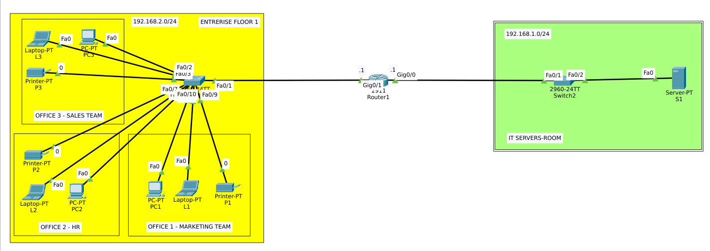

# DHCP Relay Lab — Multi-LAN Enterprise Network

## Overview



A small enterprise network with two office LANs and a centralized DHCP server located in a separate subnet (IT Servers Room). Since DHCP discovery messages are broadcast and routers don't forward broadcasts between subnets by default, this lab demonstrates **DHCP Relay** (`ip helper-address`) to let clients reach a remote DHCP server through a router.

This is a more realistic scenario than a router-based local DHCP pool — in real enterprise networks, DHCP is usually centralized on a dedicated server, not configured per-router.

## Objective

- Configure a centralized DHCP server (Server-PT) serving a remote subnet
- Configure DHCP Relay on the router so broadcast DHCP requests reach the server
- Verify clients receive correct IP, gateway, and DNS via DHCP
- Confirm end-to-end connectivity between client subnet and server subnet

## Topology

```
ENTERPRISE FLOOR 1 (192.168.2.0/24)              IT SERVERS ROOM (192.168.1.0/24)
┌─────────────────────────────┐                  ┌─────────────────────────┐
│ Office 1 - Marketing         │                  │                         │
│ Office 2 - HR                │──Switch3──Fa0/1──│ Router1 │──Gig0/0───────│ Switch2 ── Server S1 │
│ Office 3 - Sales             │      Gig0/1       │  Gig0/1  │             │                         │
│ (9 end devices, 3 printers)  │                  │                         │
└─────────────────────────────┘                  └─────────────────────────┘
```

## Devices Used

- 1× Cisco 2911 Router (Router1)
- 2× Cisco 2960 Switches
- 9× End devices (PCs, laptops) + 3× printers across 3 offices
- 1× Server-PT (S1) — DHCP server

## IP Addressing Table

| Device       | Interface | IP Address    | Subnet Mask     |
|--------------|-----------|---------------|------------------|
| Router1      | Gig0/1    | 192.168.2.1   | 255.255.255.0    |
| Router1      | Gig0/0    | 192.168.1.1   | 255.255.255.0    |
| S1 (server)  | FastEthernet0 | 192.168.1.2 (static) | 255.255.255.0 |
| Office clients | DHCP    | 192.168.2.10 – .69 (pool range) | 255.255.255.0 |

## Configuration

### Router1 — Interfaces + EIGRP

```
interface Gig0/0
 ip address 192.168.1.1 255.255.255.0
 no shutdown

interface Gig0/1
 ip address 192.168.2.1 255.255.255.0
 no shutdown

router eigrp 1
 no auto-summary
 network 192.168.1.0
 network 192.168.2.0
```

### Router1 — DHCP Relay (the key command)

```
interface Gig0/1
 ip helper-address 192.168.1.2
```

Applied on the **client-facing interface** (Gig0/1), not the server-facing one. The router forwards broadcast DHCP requests it receives on this interface as unicast to the server.

### S1 — Static IP

- IPv4: `192.168.1.2` / `255.255.255.0`
- Default Gateway: `192.168.1.1`

### S1 — DHCP Pool

| Field | Value |
|---|---|
| Pool Name | serverPool |
| Default Gateway | 192.168.2.1 |
| DNS Server | 8.8.8.8 |
| Start IP Address | 192.168.2.10 |
| Subnet Mask | 255.255.255.0 |
| Max Users | 60 |

⚠️ **Default Gateway in the pool is the client subnet's router interface (192.168.2.1), not the server's own gateway.**

## What Went Wrong (and How I Fixed It)

First attempt: clients pulled an address (`192.168.1.12`) from the wrong subnet, with the wrong gateway.

**Debugging process:**
1. Expected: address from `192.168.2.10+`, gateway `192.168.2.1`.
2. Actual (`ipconfig`): address `192.168.1.12`, gateway `192.168.1.1`.
3. Checked the DHCP pool table on S1 → found **Start IP Address** was set to `192.168.1.0` instead of `192.168.2.10` — a leftover/typo from an earlier edit.
4. Fixed the Start IP Address, saved, then power-cycled the client to clear its old DHCP lease.
5. Re-ran `ipconfig` → correct address and gateway confirmed.

This confirmed the relay itself was working the whole time — the actual bug was a data-entry error in the pool configuration, not the relay logic.

## Verification

**Client IP config (`ipconfig`):**
```
IPv4 Address....................: 192.168.2.17
Subnet Mask.....................: 255.255.255.0
Default Gateway.................: 192.168.2.1
```

**Ping to server:**
```
C:\>ping 192.168.1.2
Reply from 192.168.1.2: bytes=32 time<1ms TTL=127
Packets: Sent = 4, Received = 4, Lost = 0 (0% loss)
```

**Tracert to server:**
```
C:\>tracert 192.168.1.2
  1   0 ms   0 ms   0 ms   192.168.2.1
  2   0 ms   0 ms   0 ms   192.168.1.2
Trace complete.
```

Single-hop path confirms the DHCP-assigned gateway and routing table are both correct.

## What I Learned

- **DORA process** — Discover, Offer, Request, Ack — the four messages behind every DHCP lease.
- **Broadcast domains stop at router interfaces** — this is exactly why a remote DHCP server needs a relay agent.
- **`ip helper-address` goes on the client-facing interface**, converting broadcast DHCP requests into unicast toward the server.
- **The pool's Default Gateway field defines the client's future gateway**, not the server's own — a common point of confusion.
- **Debugging by comparing "expected vs actual"** found the real bug (a data-entry typo) faster than assuming the relay config was wrong.

## Tools

- Cisco Packet Tracer 8.x
- 1× Cisco 2911 router
- 2× Cisco 2960 switches
- 1× Server-PT

## Author

Zero — Linux & IT Infrastructure Specialist
- zero.ma · blog.zero.ma
- GitHub @0x9z

## License

MIT — free to use for learning.
```
