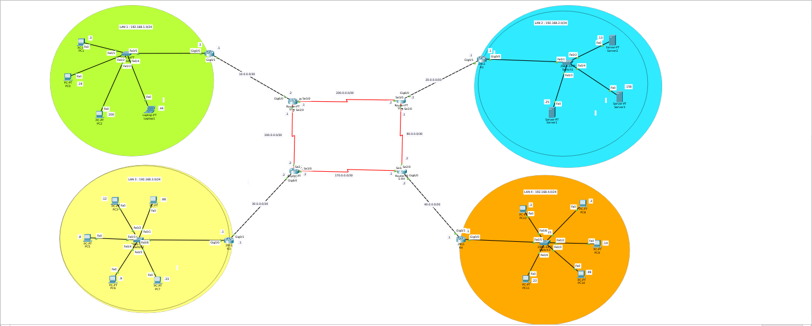
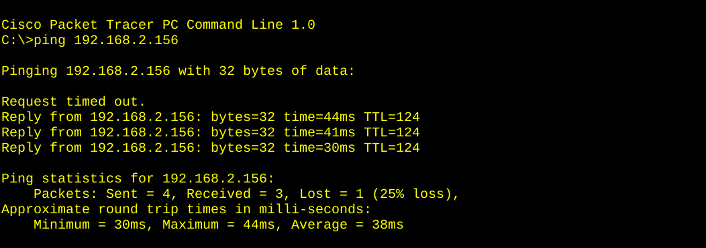
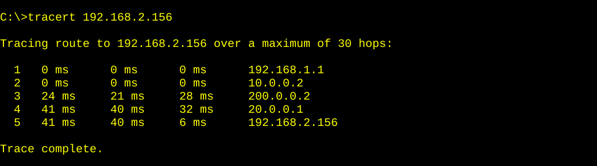
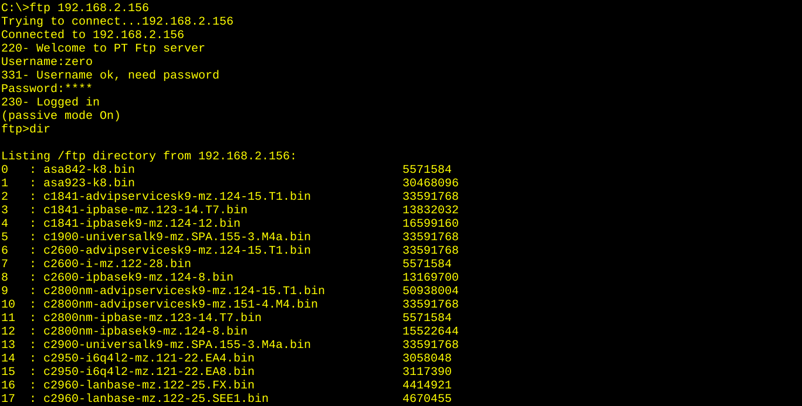

# EIGRP Multi-Site Redundant Network



## 📌 Overview

A multi-site enterprise network built in Cisco Packet Tracer using **EIGRP AS 1**
as the dynamic routing protocol. The topology spans **4 LANs** connected
through **4 core routers** and **4 serial hub routers**, with **redundant
paths** between the hubs.

This lab is the **EIGRP counterpart** to the RIPv2 Multi-Site Redundant lab,
allowing direct comparison of how both protocols handle the same topology.

## 🎯 Objective

- Configure EIGRP AS 1 on all routers with `no auto-summary`
- Advertise directly connected networks using classful `network` statements
- Verify full connectivity across all LANs
- Demonstrate redundancy via equal-cost paths (EIGRP supports up to 16)
- Test FTP file transfer across the routed network
- Compare EIGRP behavior with RIPv2 on the same topology

## 📊 Topology


### Sites

| Site | Network | Purpose |
|------|---------|---------|
| LAN 1 | 192.168.1.0/24 | Left branch |
| LAN 2 | 192.168.2.0/24 | Top-right branch |
| LAN 3 | 192.168.3.0/24 | Bottom-left branch |
| LAN 4 | 192.168.4.0/24 | Bottom-right branch |

### Devices Used

- **4×** Cisco 2911 routers (R1, R2, R3, R4)
- **4×** PT1000 serial routers (SERIAL-R1 to SERIAL-R4)
- **4×** Cisco 2960 switches
- **8×** PC-PT / Laptop-PT
- **3×** Server-PT (FTP servers in LAN 2)

### WAN Links

| Link | Network |
|------|---------|
| R1 ↔ SERIAL-R1 | 10.0.0.0/30 |
| R2 ↔ SERIAL-R2 | 20.0.0.0/30 |
| R3 ↔ SERIAL-R3 | 30.0.0.0/30 |
| R4 ↔ SERIAL-R4 | 40.0.0.0/30 |
| SERIAL-R1 ↔ SERIAL-R3 | 100.0.0.0/30 |
| SERIAL-R1 ↔ SERIAL-R2 | 200.0.0.0/30 |
| SERIAL-R2 ↔ SERIAL-R4 | 90.0.0.0/30 |
| SERIAL-R3 ↔ SERIAL-R4 | 170.0.0.0/30 |

**Redundancy:** The serial hub links form a redundant ring — SERIAL-R1 connects to both SERIAL-R2 and SERIAL-R3, while SERIAL-R4 connects to both SERIAL-R2 and SERIAL-R3. EIGRP handles this automatically with equal-cost load balancing.

## 📋 IP Addressing Table

### LAN Gateways

| Router | LAN Interface | IP | Network |
|--------|---------------|-----|---------|
| R1 | Gig0/0 | 192.168.1.1 | 192.168.1.0/24 |
| R2 | Gig0/0 | 192.168.2.1 | 192.168.2.0/24 |
| R3 | Gig0/0 | 192.168.3.1 | 192.168.3.0/24 |
| R4 | Gig0/0 | 192.168.4.1 | 192.168.4.0/24 |

### Serial Interfaces

| Router | Interface | IP | Network |
|--------|-----------|-----|---------|
| R1 | Gig0/1 | 10.0.0.1 | 10.0.0.0/30 |
| SERIAL-R1 | Gig6/0 | 10.0.0.2 | 10.0.0.0/30 |
| SERIAL-R1 | Se2/0 | 100.0.0.1 | 100.0.0.0/30 |
| SERIAL-R1 | Se3/0 | 200.0.0.1 | 200.0.0.0/30 |
| SERIAL-R2 | Se2/0 | 90.0.0.1 | 90.0.0.0/30 |
| SERIAL-R2 | Se3/0 | 200.0.0.2 | 200.0.0.0/30 |
| SERIAL-R2 | Gig6/0 | 20.0.0.2 | 20.0.0.0/30 |
| SERIAL-R3 | Se2/0 | 100.0.0.2 | 100.0.0.0/30 |
| SERIAL-R3 | Se3/0 | 170.0.0.2 | 170.0.0.0/30 |
| SERIAL-R3 | Gig6/0 | 30.0.0.2 | 30.0.0.0/30 |
| SERIAL-R4 | Se2/0 | 90.0.0.2 | 90.0.0.0/30 |
| SERIAL-R4 | Se3/0 | 170.0.0.1 | 170.0.0.0/30 |
| SERIAL-R4 | Gig6/0 | 40.0.0.2 | 40.0.0.0/30 |
| R4 | Gig0/1 | 40.0.0.1 | 40.0.0.0/30 |

## ⚙️ EIGRP Configuration

Applied on **all 8 routers**:

```
router eigrp 1
 no auto-summary
 network <classful-network>
 exit
```

### Network Statements by Router

| Router | Network Statements |
|--------|--------------------|
| R1 | `192.168.1.0` · `10.0.0.0` |
| R2 | `192.168.2.0` · `20.0.0.0` |
| R3 | `192.168.3.0` · `30.0.0.0` |
| R4 | `192.168.4.0` · `40.0.0.0` |
| SERIAL-R1 | `10.0.0.0` · `100.0.0.0` · `200.0.0.0` |
| SERIAL-R2 | `20.0.0.0` · `200.0.0.0` · `90.0.0.0` |
| SERIAL-R3 | `30.0.0.0` · `100.0.0.0` · `170.0.0.0` |
| SERIAL-R4 | `40.0.0.0` · `90.0.0.0` · `170.0.0.0` |

### ⚠️ Key Notes

- **EIGRP AS number must match** on all routers (AS 1 used here).
- `no auto-summary` is required for discontiguous subnets.
- Classful `network` statements — no masks, no wildcards.
- Serial DCE interfaces require `clock rate 64000`.
- EIGRP metric = bandwidth + delay (composite).
- Administrative distance for internal EIGRP = 90.

## 🔍 Verification

### EIGRP Neighbor Adjacencies

```
%DUAL-5-NBRCHANGE: IP-EIGRP 1: Neighbor 10.0.0.2 (GigabitEthernet0/1) is up: new adjacency
%DUAL-5-NBRCHANGE: IP-EIGRP 1: Neighbor 200.0.0.2 (Serial3/0) is up: new adjacency
%DUAL-5-NBRCHANGE: IP-EIGRP 1: Neighbor 100.0.0.2 (Serial2/0) is up: new adjacency
```

**Every adjacency formed automatically.** ✅

### EIGRP Route Table (R1)

```
R1#show ip route
D    20.0.0.0/8 [90/20512512] via 10.0.0.2
D    30.0.0.0/8 [90/20512512] via 10.0.0.2
D    40.0.0.0/8 [90/21024512] via 10.0.0.2
D    90.0.0.0/8 [90/21024256] via 10.0.0.2
D    100.0.0.0/8 [90/20512256] via 10.0.0.2
D    170.0.0.0/8 [90/21024256] via 10.0.0.2
D    192.168.2.0/24 [90/20515072] via 10.0.0.2
D    192.168.3.0/24 [90/20515072] via 10.0.0.2
D    192.168.4.0/24 [90/21027072] via 10.0.0.2
D    200.0.0.0/8 [90/20512256] via 10.0.0.2
```

### Tracert from LAN 3 to LAN 2

```
C:\>tracert 192.168.2.25
  1   192.168.1.1       (R1)
  2   10.0.0.2          (SERIAL-R1)
  3   200.0.0.2         (SERIAL-R2)
  4   20.0.0.1          (R2)
  5   192.168.2.25      (FTP Server)
Trace complete.
```

### FTP Test (from PC1 in LAN1 to server 192.168.2.25)

```
C:\>ftp 192.168.2.25
Connected to 192.168.2.25
Username: zero
Password: ****
ftp> dir
ftp> get text.txt
[Transfer complete - 7 bytes]
ftp> quit
```

**Result:** Files transferred successfully across the routed network. ✅

### CDP Neighbor Discovery (SERIAL-R1)

```
SERIAL-R1#show cdp neighbor

Device ID    Local Intrfce   Holdtme    Capability   Platform    Port ID
R1           Gig 6/0          137            R       C2900       Gig 0/1
S-R2         Ser 3/0          159            R       PT1000      Ser 3/0
S-R3         Ser 2/0          163            R       PT1000      Ser 2/0
```

## 🧠 What I Learned

- **EIGRP configuration** — AS number, `no auto-summary`, classful networks
- **Redundancy** — EIGRP supports equal-cost load balancing across multiple paths
- **Multi-hop routing** — packets traverse up to 5 routers across the topology
- **FTP across routed networks** — file transfer works end-to-end
- **CDP discovery** — mapping the topology without a diagram
- **Tracert analysis** — understanding path selection
- **Self-debugging** — caught misconfigured interfaces and hostname typos

## 🎯 Comparison: EIGRP vs RIPv2

| Aspect | RIPv2 | EIGRP |
|--------|-------|-------|
| Metric | Hop count | Bandwidth + Delay |
| Max hops | 15 | 255 |
| Convergence | Slow | Fast |
| Load balancing | Equal-cost only | Equal + unequal (variance) |
| AS number | Not required | Required (must match) |
| Admin distance | 120 | 90 |
| Protocol type | UDP 520 | IP protocol 88 |

## 🛠️ Tools

- Cisco Packet Tracer 8.x
- 4× Cisco 2911 routers
- 4× PT1000 serial routers
- 4× Cisco 2960 switches

## 📸 Screenshots

| Topology |
|----------|
|  |
|  |
|  |
|  |

## 👤 Author

**Zero** — Linux & IT Infrastructure Specialist

- 🌐 [zero.ma](https://zero.ma) · [cybernetwork.technology](https://cybernetwork.technology)
- 🐙 [GitHub @0x9z](https://github.com/0x9z)
- 💼 [LinkedIn](https://linkedin.com/in/0x9z)

## 📄 License

MIT — free to use for learning.
