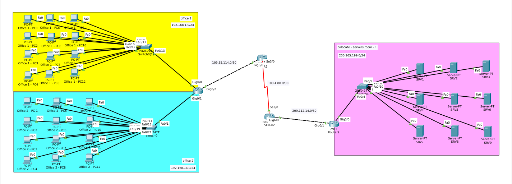
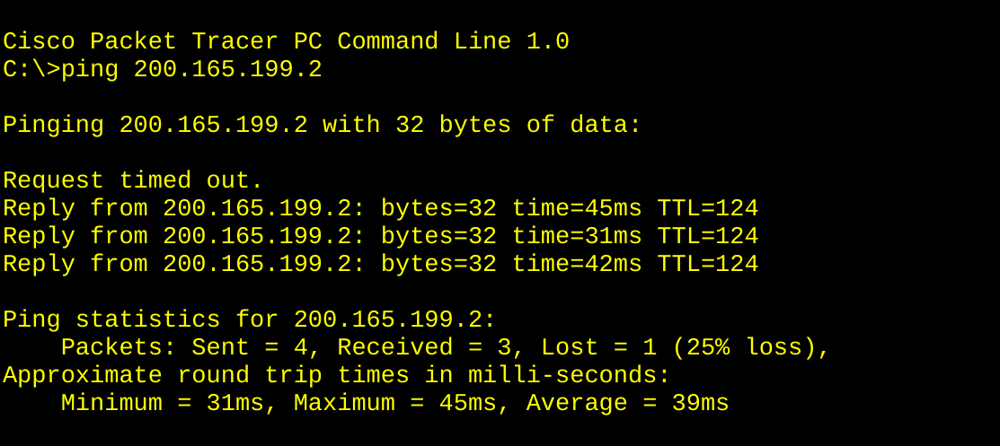
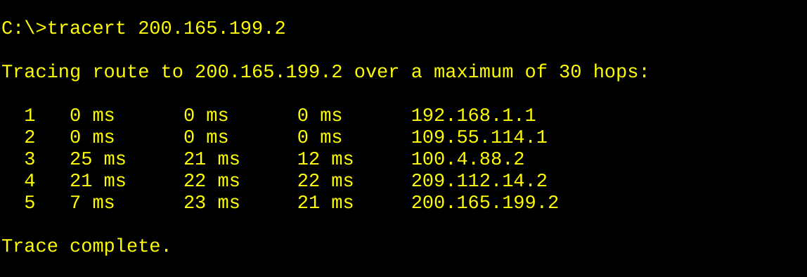

# RIPv2 Multi-Site Enterprise Network 



## Overview

A multi-site enterprise network built in Cisco Packet Tracer demonstrating
**RIPv2 dynamic routing** across 4 routers, 3 switches, 24 PCs, and 9 servers.

The topology spans **two branch offices** and a **centralized server room**,
connected through three point-to-point WAN links.

## Objective

Replace static routing with RIPv2 so all sites can reach each other
automatically, without manually configuring routes on every router.

## Topology

| Site | Devices | Network |
|------|---------|---------|
| Office 1 | 12 PCs, 1 switch, 1 router | 192.168.1.0/24 |
| Office 2 | 12 PCs, 1 switch, 1 router | 192.168.14.0/24 |
| Server Room | 9 servers, 1 switch, 1 router | 200.165.199.0/24 |
| WAN C1-R1 ↔ R1 | Point-to-point | 109.55.114.0/30 |
| WAN R1 ↔ SER-R2 | Point-to-point | 100.4.88.0/30 |
| WAN SER-R2 ↔ Router9 | Point-to-point | 209.112.14.0/30 |

### Devices Used

- **4×** Cisco 2911 Routers
- **3×** Cisco 2960 Switches
- **24×** PC-PT (Office 1 + Office 2)
- **9×** Server-PT (Server Room)

## IP Addressing Table

| Device / Link | Interface | IP Address | Subnet Mask |
|---------------|-----------|------------|-------------|
| C1-R1 → Office 1 | Gig0/0 | 192.168.1.1 | 255.255.255.0 |
| C1-R1 → Office 2 | Gig0/1 | 192.168.14.1 | 255.255.255.0 |
| C1-R1 → R1 | Gig0/2 | 109.55.114.2 | 255.255.255.252 |
| R1 → C1-R1 | Gig6/0 | 109.55.114.1 | 255.255.255.252 |
| R1 → SER-R2 | Se3/0 | 100.4.88.1 | 255.255.255.252 |
| SER-R2 → R1 | Se3/0 | 100.4.88.2 | 255.255.255.252 |
| SER-R2 → Router9 | Gig6/0 | 209.112.14.1 | 255.255.255.252 |
| Router9 → SER-R2 | Gig0/1 | 209.112.14.2 | 255.255.255.252 |
| Router9 → Servers | Gig0/0 | 200.165.199.1 | 255.255.255.0 |
| Office 1 PCs | NIC | 192.168.1.10–21 | 255.255.255.0 |
| Office 2 PCs | NIC | 192.168.14.10–21 | 255.255.255.0 |
| Servers | NIC | 200.165.199.10–18 | 255.255.255.0 |

## RIPv2 Configuration

Applied on **all 4 routers**:

```
router rip
 version 2
 no auto-summary
 network <classful-network>
 exit
```

| Router | Network Statements |
|--------|--------------------|
| C1-R1 | `192.168.1.0` · `192.168.14.0` · `109.0.0.0` |
| R1 | `109.0.0.0` · `100.0.0.0` |
| SER-R2 | `100.0.0.0` · `209.112.14.0` |
| Router9 | `200.165.199.0` · `209.112.14.0` |

### Key Notes

- RIPv2 `network` uses **classful** notation — no mask, no prefix.
- `no auto-summary` is required for discontiguous subnets.
- Only **directly connected** networks are advertised — remote networks
  are learned automatically via RIP updates.
- `/30` masks must match on both ends of a point-to-point link.
- Clock rate is configured on the **DCE side** only (R1 Se3/0).

## 
Verification

### From Office 1 PC → Office 2 PC

```
ping 192.168.14.10
Reply from 192.168.14.10: bytes=32 time<1ms TTL=127
Sent = 4, Received = 4, Lost = 0 (0% loss)
```

### From Office 1 PC → Server 9

```
ping 200.165.199.10
Reply from 200.165.199.10: bytes=32 time=99ms TTL=124
Sent = 13, Received = 13, Lost = 0 (0% loss)
```

### Tracert Output

```
1   0 ms      192.168.1.1        (C1-R1)
2   0 ms      109.55.114.1       (R1)
3   58 ms     100.4.88.2         (SER-R2)
4   37 ms     209.112.14.2       (Router9)
5   15 ms     200.165.199.10     (Server9)
Trace complete.
```

TTL analysis confirms the **4-hop path** matches the physical topology.

## What I Learned

- **Classful vs classless** — why `network 109.0.0.0` works but
  `network 109.55.114.1/30` does not.
- **Auto-summary** breaks discontiguous networks — `no auto-summary`
  is essential.
- **`/30` consistency** on both ends of a point-to-point link.
- **TTL math** — `TTL = 128 − hops` confirms path length.
- **RIP convergence** — remote networks are learned automatically
  after ~30 seconds.
- **Troubleshooting methodology** — verify interface → verify route →
  verify end-to-end.

## Tools

- Cisco Packet Tracer 8.x
- 4× Cisco 2911 routers
- 3× Cisco 2960 switches

## Screenshots

| Topology | Ping Test | Tracert |
|----------|-----------|---------|
|  |  |  |

## Author

**Zero** — Linux & IT Infrastructure Specialist

- [zero.ma](https://zero.ma)
- [GitHub @0x9z](https://github.com/0x9z)
- [LinkedIn](https://linkedin.com/in/0x9z)

## License

MIT License — free to use for learning.
