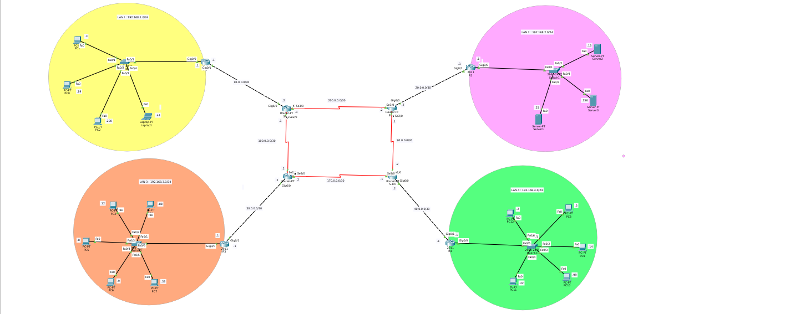
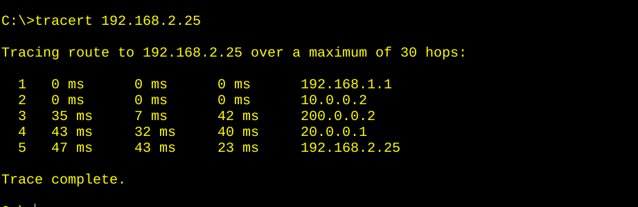
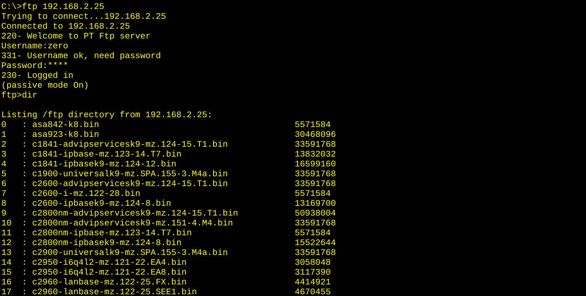

# RIPv2 Multi-Site Redundant Network 



## 📌 Overview

A multi-site enterprise network built in Cisco Packet Tracer using **RIPv2**
as the dynamic routing protocol. The topology spans **4 LANs** connected
through **4 core routers** and **4 serial hub routers**, with **redundant
paths** between the hubs.

The lab demonstrates route propagation, redundancy, and end-to-end
connectivity across multiple subnets using only classful network statements.

## 🎯 Objective

- Configure RIPv2 on all routers with `version 2` and `no auto-summary`
- Advertise directly connected networks using classful `network` statements
- Verify full connectivity across all LANs
- Demonstrate redundancy via equal-cost paths
- Test FTP file transfer across the routed network
- Verify topology with CDP neighbor discovery

## 📊 Topology


### Sites

| Site | Network | Purpose |
|------|---------|---------|
| LAN 1 | 192.168.1.0/24 | Left branch |
| LAN 2 | 192.168.2.0/24 | Top-right branch |
| LAN 3 | 192.168.3.0/24 | Bottom-left branch |
| LAN 4 | 192.168.4.0/24 | Bottom-right branch |

### Devices Used

- **4×** Cisco 2911 routers (R1, R2, R3, R4)
- **4×** PT1000 serial routers (SERIAL-R1 to SERIAL-R4)
- **4×** Cisco 2960 switches
- **8×** PC-PT / Laptop-PT
- **3×** Server-PT (FTP servers in LAN 2)

### WAN Links (all /30 or /8 in PT)

| Link | Network |
|------|---------|
| R1 ↔ SERIAL-R1 | 10.0.0.0/30 |
| R2 ↔ SERIAL-R2 | 20.0.0.0/30 |
| R3 ↔ SERIAL-R3 | 30.0.0.0/30 |
| R4 ↔ SERIAL-R4 | 40.0.0.0/30 |
| SERIAL-R1 ↔ SERIAL-R3 | 100.0.0.0/30 |
| SERIAL-R1 ↔ SERIAL-R2 | 200.0.0.0/30 |
| SERIAL-R2 ↔ SERIAL-R4 | 90.0.0.0/30 |
| SERIAL-R3 ↔ SERIAL-R4 | 170.0.0.0/30 |

**Note:** The serial hub links form a **redundant ring** — SERIAL-R1 connects
to both SERIAL-R2 and SERIAL-R3, while SERIAL-R4 connects to both
SERIAL-R2 and SERIAL-R3. This provides **loop redundancy** that RIPv2
handles automatically.

## 📋 IP Addressing Table

### LAN Gateways

| Router | LAN Interface | IP | Network |
|--------|---------------|-----|---------|
| R1 | Gig0/0 | 192.168.1.1 | 192.168.1.0/24 |
| R2 | Gig0/0 | 192.168.2.1 | 192.168.2.0/24 |
| R3 | Gig0/0 | 192.168.3.1 | 192.168.3.0/24 |
| R4 | Gig0/0 | 192.168.4.1 | 192.168.4.0/24 |

### Serial Interfaces

| Router | Interface | IP | Network |
|--------|-----------|-----|---------|
| R1 | Gig0/1 | 10.0.0.1 | 10.0.0.0/30 |
| SERIAL-R1 | Gig6/0 | 10.0.0.2 | 10.0.0.0/30 |
| SERIAL-R1 | Se2/0 | 100.0.0.1 | 100.0.0.0/30 |
| SERIAL-R1 | Se3/0 | 200.0.0.1 | 200.0.0.0/30 |
| SERIAL-R2 | Se2/0 | 90.0.0.1 | 90.0.0.0/30 |
| SERIAL-R2 | Se3/0 | 200.0.0.2 | 200.0.0.0/30 |
| SERIAL-R2 | Gig6/0 | 20.0.0.2 | 20.0.0.0/30 |
| SERIAL-R3 | Se2/0 | 100.0.0.2 | 100.0.0.0/30 |
| SERIAL-R3 | Se3/0 | 170.0.0.2 | 170.0.0.0/30 |
| SERIAL-R3 | Gig6/0 | 30.0.0.2 | 30.0.0.0/30 |
| SERIAL-R4 | Se2/0 | 90.0.0.2 | 90.0.0.0/30 |
| SERIAL-R4 | Se3/0 | 170.0.0.1 | 170.0.0.0/30 |
| SERIAL-R4 | Gig6/0 | 40.0.0.2 | 40.0.0.0/30 |
| R4 | Gig0/1 | 40.0.0.1 | 40.0.0.0/30 |

## ⚙️ RIPv2 Configuration

Applied on **all 8 routers**:

```
router rip
 version 2
 no auto-summary
 network <classful-network>
 exit
```

### Network Statements by Router

| Router | Network Statements |
|--------|--------------------|
| R1 | `192.168.1.0` · `10.0.0.0` |
| R2 | `192.168.2.0` · `20.0.0.0` |
| R3 | `192.168.3.0` · `30.0.0.0` |
| R4 | `192.168.4.0` · `40.0.0.0` |
| SERIAL-R1 | `10.0.0.0` · `100.0.0.0` · `200.0.0.0` |
| SERIAL-R2 | `20.0.0.0` · `200.0.0.0` · `90.0.0.0` |
| SERIAL-R3 | `30.0.0.0` · `100.0.0.0` · `170.0.0.0` |
| SERIAL-R4 | `40.0.0.0` · `90.0.0.0` · `170.0.0.0` |

### ⚠️ Key Notes

- **Classful `network` statements** — no masks, no wildcards.
- `no auto-summary` is required for discontiguous subnets.
- Serial DCE interfaces require `clock rate 64000`.
- RIPv2 metric = hop count (max 15).
- Administrative distance for RIP = 120.

## 🔍 Verification

### Ping from PC5 (LAN 3) to R1 (LAN 1)

```
C:\>ping 192.168.1.1
Reply from 192.168.1.1: bytes=32 time=37ms TTL=252
Sent = 4, Received = 4, Lost = 0 (0% loss)
```

### Tracert from LAN 3 to LAN 1

```
C:\>tracert 192.168.1.1
  1   192.168.3.1       (R3)
  2   30.0.0.2          (SERIAL-R3)
  3   100.0.0.1         (SERIAL-R1)
  4   192.168.1.1       (R1)
Trace complete.
```

### Tracert from LAN 3 to LAN 2

```
C:\>tracert 192.168.2.1
  1   192.168.3.1       (R3)
  2   30.0.0.2          (SERIAL-R3)
  3   170.0.0.1         (SERIAL-R4)
  4   200.0.0.2         (SERIAL-R2)
  5   192.168.2.1       (R2)
Trace complete.
```

**Redundant paths:** Notice LAN 3 can reach LAN 2 via either SERIAL-R3
→ SERIAL-R4 → SERIAL-R2, or SERIAL-R3 → SERIAL-R1 → SERIAL-R2.
RIPv2 picks the shortest hop count.

### FTP Test (from PC1 in LAN1 to server 192.168.2.25)

```
C:\>ftp 192.168.2.25
Connected to 192.168.2.25
Username: zero
Password: ****
ftp> dir
ftp> get text.txt
[Transfer complete - 7 bytes]
ftp> get secret.txt
[Transfer complete - 26 bytes]
ftp> quit
```

**Result:** Files transferred successfully across the routed network. ✅

### CDP Neighbor Discovery (SERIAL-R1)

```
SERIAL-R1#show cdp neighbor

Device ID    Local Intrfce   Holdtme    Capability   Platform    Port ID
R1           Gig 6/0          170            R       C2900       Gig 0/1
S-R2         Ser 3/0          151            R       PT1000      Ser 3/0
S-R3         Ser 2/0          151            R       PT1000      Ser 2/0
```

## 🧠 What I Learned

- **RIPv2 configuration** — classful `network` statements, `no auto-summary`
- **Redundancy** — RIPv2 handles loops with split horizon and hop count
- **Multi-hop routing** — packets traverse up to 5 routers across the topology
- **FTP across routed networks** — file transfer works end-to-end
- **CDP discovery** — mapping the topology without a diagram
- **Tracert analysis** — understanding path selection
- **Self-debugging** — caught misconfigured interfaces and mask errors

## 🎯 Key Insight

> RIPv2 is a simple distance-vector protocol, but it handles redundancy
> and route propagation across multiple sites without manual intervention.
> This lab proves that a properly designed RIPv2 network can deliver
> full connectivity with minimal configuration.

## 🛠️ Tools

- Cisco Packet Tracer 8.x
- 4× Cisco 2911 routers
- 4× PT1000 serial routers
- 4× Cisco 2960 switches

## 📸 Screenshots

| Topology |
|----------|
|  |
|  |
|  |

## 👤 Author

**Zero** — Linux & IT Infrastructure Specialist

- 🌐 [zero.ma](https://zero.ma) · [cybernetwork.technology](https://cybernetwork.technology)
- 🐙 [GitHub @0x9z](https://github.com/0x9z)
- 💼 [LinkedIn](https://linkedin.com/in/0x9z)

## 📄 License

MIT — free to use for learning.
