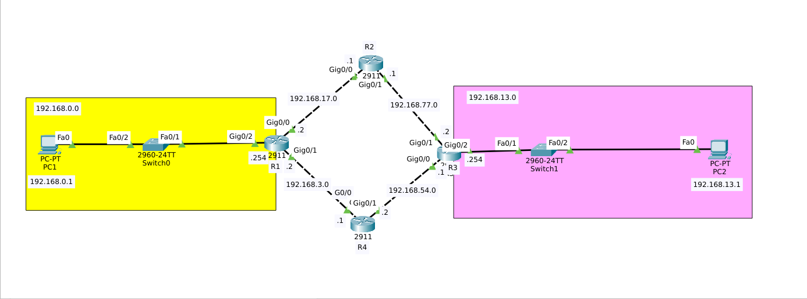

# Static Routing Lab — 4 Routers

## 📌 Overview
This lab demonstrates a static routing configuration between 4 routers, 2 switches, and 2 PCs.

## 📊 Topology

## 📋 Subnets Used

| Subnet | Device |
|--------|--------|
| 192.168.0.0/24 | PC0 Network |
| 192.168.3.0/24 | R1-R4 Link |
| 192.168.13.0/24 | PC1 Network |
| 192.168.17.0/24 | R1-R2 Link |
| 192.168.54.0/24 | R3-R4 Link |
| 192.168.77.0/24 | R2-R3 Link |

## 📝 Static Routes

**R1:**
ip route 192.168.0.0 255.255.255.0 192.168.17.2

**R2:**
ip route 192.168.13.0 255.255.255.0 192.168.77.2

## ✅ Result
Full connectivity confirmed between PC0 and PC1.

---

## 🛠️ Tools
- Cisco Packet Tracer 8.x

## 👤 Author
**Zero** — [GitHub](https://github.com/0x9z) | [LinkedIn](https://linkedin.com/in/0x9z) | [Website](https://zero.ma/)
